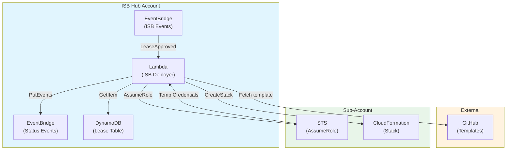

# System Architecture: Innovation Sandbox on AWS Deployer

**Date:** 2025-12-03
**Architect:** cns
**Version:** 1.0
**Project Type:** Infrastructure
**Project Level:** 3 (Complex - 12-40 stories)
**Status:** Draft

---

## Document Overview

This document defines the system architecture for the Innovation Sandbox on AWS Deployer. It provides the technical blueprint for implementation, addressing all functional and non-functional requirements from the PRD.

**Related Documents:**
- Product Requirements Document: [docs/prd-innovation-sandbox-on-aws-deployer-2025-12-03.md](./prd-innovation-sandbox-on-aws-deployer-2025-12-03.md)
- Product Brief: [docs/product-brief-innovation-sandbox-on-aws-deployer-2025-12-03.md](./product-brief-innovation-sandbox-on-aws-deployer-2025-12-03.md)

---

## Executive Summary

This architecture defines an event-driven serverless system that automatically deploys CloudFormation templates to Innovation Sandbox sub-accounts when leases are approved. The system is triggered by EventBridge events from ISB, fetches scenario templates from GitHub, and deploys them using cross-account IAM role assumption.

**Key Architectural Decisions:**
- Single Lambda function with internal modular structure
- Event-driven integration with ISB (no modifications to ISB core)
- Graceful error handling that never breaks ISB functionality
- Minimal dependencies for maintainability and ISB adoption

---

## Architectural Drivers

These requirements heavily influence architectural decisions:

| Priority | NFR | Requirement | Architectural Impact |
|----------|-----|-------------|---------------------|
| 1 | NFR-002 | Least Privilege Security | Scoped IAM policies, no wildcards |
| 1 | NFR-003 | Secrets Management | No secrets required (public repo), no hardcoded values |
| 2 | NFR-004 | Graceful Error Handling | Try/catch everywhere, failure isolation |
| 3 | NFR-006 | Code Simplicity | Single Lambda, < 5 dependencies |

---

## System Overview

### High-Level Architecture

The system follows an **Event-Driven Serverless** pattern with a single Lambda function orchestrating the deployment workflow.

**Components:**
1. **EventBridge Rule** - Triggers on ISB lease approval events
2. **Lambda Function** - Core deployer logic (single function)
3. **DynamoDB** - Read lease metadata (existing ISB table)
4. **GitHub** - Fetch CloudFormation templates
5. **STS** - Assume cross-account role
6. **CloudFormation** - Deploy stack in sub-account
7. **EventBridge** - Emit success/failure events

**Interaction Flow:**
```
ISB LeaseApproved → EventBridge → Lambda → [DynamoDB lookup] → [GitHub fetch]
                                         → [STS AssumeRole] → [CF Deploy]
                                         → EventBridge (success/failure)
```

### Architecture Diagram



### Architectural Pattern

**Pattern:** Event-Driven Serverless

**Rationale:**
- Naturally fits the trigger-action workflow
- No persistent compute required
- AWS manages scaling and availability
- Cost-effective for low-volume workload
- Loose coupling with ISB via EventBridge

---

## Technology Stack

### Runtime

**Choice:** Node.js 20.x (Lambda)

**Rationale:** PRD constraint mandates Node.js. Version 20.x provides modern features (native fetch), long-term support, and excellent AWS SDK compatibility.

**Trade-offs:**
- ✓ Gain: Fast cold starts, native AWS SDK, built-in fetch
- ✗ Lose: Type safety (mitigated with TypeScript)

### Language

**Choice:** TypeScript

**Rationale:** Type safety catches errors at compile time, improves IDE support, and creates self-documenting code for ISB team adoption.

**Trade-offs:**
- ✓ Gain: Type safety, better tooling, maintainability
- ✗ Lose: Build step required

### Infrastructure

**Choice:** AWS CloudFormation (YAML)

**Rationale:** PRD FR-015 requires CloudFormation. Native AWS, no additional tooling, matches ISB patterns.

**Trade-offs:**
- ✓ Gain: Native AWS, no dependencies, ISB compatibility
- ✗ Lose: Less expressive than CDK

### HTTP Client

**Choice:** Native fetch (Node.js built-in)

**Rationale:** Zero dependencies, available in Node.js 18+, sufficient for GitHub raw file access.

**Trade-offs:**
- ✓ Gain: Zero dependencies, built-in
- ✗ Lose: No GitHub-specific features (acceptable)

### AWS SDK

**Choice:** AWS SDK v3 (modular)

**Rationale:** Modern, tree-shakeable SDK with smaller bundles and better TypeScript support.

### Testing

**Choice:** Vitest

**Rationale:** Fast, modern test runner with ESM support, Jest-compatible API, excellent TypeScript integration.

### Build

**Choice:** esbuild

**Rationale:** Extremely fast bundling, tree-shaking, minification for optimal Lambda package size.

### Summary

| Category | Technology | Justification |
|----------|------------|---------------|
| Runtime | Node.js 20.x | PRD constraint, fast cold starts |
| Language | TypeScript | Type safety, maintainability |
| IaC | CloudFormation | PRD requirement, native AWS |
| AWS SDK | SDK v3 | Modern, tree-shakeable |
| HTTP | Native fetch | Zero deps, built-in |
| Testing | Vitest | Fast, TypeScript-native |
| Logging | JSON console | CloudWatch native |
| Build | esbuild | Fast bundling |

---

## System Components

### Component 1: EventBridge Rule

**Purpose:** Trigger Lambda on ISB lease approval events

**Responsibilities:**
- Filter EventBridge events for lease approval pattern
- Route matching events to Lambda function
- Pass event payload to Lambda

**Interfaces:**
- Input: ISB EventBridge events
- Output: Lambda invocation

**FRs Addressed:** FR-001, FR-016

---

### Component 2: Lambda Handler

**Purpose:** Entry point for event processing

**Responsibilities:**
- Parse incoming EventBridge event
- Orchestrate deployment workflow
- Handle top-level errors gracefully
- Emit status events

**Interfaces:**
- Input: EventBridge event (JSON)
- Output: EventBridge events

**FRs Addressed:** FR-001, FR-010, FR-011

---

### Component 3: Event Parser Module

**Purpose:** Extract lease metadata from event payload

**Responsibilities:**
- Parse EventBridge event structure
- Extract lease ID, account ID, template name
- Validate required fields

**FRs Addressed:** FR-002

---

### Component 4: Lease Lookup Module

**Purpose:** Enrich lease data from DynamoDB

**Responsibilities:**
- Query ISB lease table
- Retrieve lease attributes for parameter mapping
- Handle missing records

**Dependencies:** AWS SDK DynamoDB client

**FRs Addressed:** FR-008, FR-014

---

### Component 5: Template Fetcher Module

**Purpose:** Retrieve CloudFormation templates from GitHub

**Responsibilities:**
- Construct GitHub URL from config + template name
- Fetch template YAML content
- Handle 404 gracefully (no error)
- Parse and validate YAML

**Dependencies:** Native fetch

**FRs Addressed:** FR-003, FR-004, FR-012

---

### Component 6: Role Assumer Module

**Purpose:** Obtain cross-account credentials

**Responsibilities:**
- Assume IAM role in target sub-account
- Return temporary credentials
- Handle role assumption failures

**Dependencies:** AWS SDK STS client

**FRs Addressed:** FR-005, FR-013

---

### Component 7: Stack Deployer Module

**Purpose:** Deploy CloudFormation stack to sub-account

**Responsibilities:**
- Generate unique stack name
- Map lease attributes to CF parameters
- Create CloudFormation stack
- Handle deployment errors

**Dependencies:** AWS SDK CloudFormation client

**FRs Addressed:** FR-006, FR-007, FR-009

---

### Component 8: Event Emitter Module

**Purpose:** Publish deployment status events

**Responsibilities:**
- Emit success events with stack details
- Emit failure events with error details
- Format events consistently

**Dependencies:** AWS SDK EventBridge client

**FRs Addressed:** FR-010, FR-011

---

### Component 9: Logger Module

**Purpose:** Structured logging for observability

**Responsibilities:**
- JSON-formatted log output
- Include correlation IDs (lease ID)
- Log key events
- Redact sensitive data

**FRs Addressed:** NFR-009

---

### Component 10: Configuration Module

**Purpose:** Manage environment variables

**Responsibilities:**
- Load environment variables
- Provide defaults
- Validate required config

**FRs Addressed:** FR-012, FR-013, FR-014

---

## Data Architecture

### Data Model

This service is a **data consumer**, not a data owner. It reads from existing ISB data sources.

**External Entities (Read Only):**

```typescript
// LeaseEvent (EventBridge)
interface LeaseEvent {
  version: string;
  id: string;
  "detail-type": string;
  source: string;
  account: string;
  time: string;
  region: string;
  detail: {
    leaseId: string;
    accountId: string;
    templateName?: string;
    status: string;
  };
}

// Lease (DynamoDB - ISB Owned)
interface Lease {
  leaseId: string;
  accountId: string;
  templateName: string;
  budgetAmount: number;
  expirationDate: string;
  requesterEmail: string;
}

// Internal Runtime Context
interface DeploymentContext {
  leaseId: string;
  accountId: string;
  templateName: string;
  lease: Lease;
  template: string | null;
  stackName: string;
  parameters: CloudFormationParameter[];
}
```

### Database Design

**No new tables required.** This service is stateless.

| Table | Owner | Access | Purpose |
|-------|-------|--------|---------|
| ISB Lease Table | ISB | Read | Lease metadata for parameters |

### Data Flow

```
1. EventBridge → Lambda (lease event)
2. Lambda → DynamoDB (lease lookup)
3. Lambda → GitHub (template fetch)
4. Lambda → STS (assume role)
5. Lambda → CloudFormation (create stack)
6. Lambda → EventBridge (status event)
```

---

## API Design

### API Architecture

This service is **event-driven** and doesn't expose a REST API.

**Communication:**
- Input: EventBridge events (from ISB)
- Output: EventBridge events (status notifications)

### Event Contracts

#### Input: LeaseApproved

```json
{
  "source": ["innovation-sandbox"],
  "detail-type": ["LeaseApproved"],
  "detail": {
    "leaseId": "lease-123",
    "accountId": "123456789012",
    "templateName": "council-chatbot"
  }
}
```

#### Output: Deployment Succeeded

```json
{
  "source": "isb-deployer",
  "detail-type": "Deployment Succeeded",
  "detail": {
    "leaseId": "lease-123",
    "accountId": "123456789012",
    "templateName": "council-chatbot",
    "stackName": "isb-council-chatbot-lease-123",
    "stackId": "arn:aws:cloudformation:..."
  }
}
```

#### Output: Deployment Failed

```json
{
  "source": "isb-deployer",
  "detail-type": "Deployment Failed",
  "detail": {
    "leaseId": "lease-123",
    "accountId": "123456789012",
    "templateName": "council-chatbot",
    "error": "RoleAssumptionFailed",
    "message": "Access denied when assuming role"
  }
}
```

### External API: GitHub

**Endpoint:** `https://raw.githubusercontent.com/{owner}/{repo}/{branch}/{path}`

**Authentication:** None required (public repo, unauthenticated raw access)

---

## Non-Functional Requirements Coverage

### NFR-001: Performance - Execution Time

**Requirement:** Lambda < 30s, GitHub fetch < 5s

**Solution:**
- Lambda timeout: 60 seconds
- Fetch timeout: 5 seconds for GitHub
- AWS SDK v3 modular imports
- esbuild minification

**Validation:** CloudWatch Duration p95 < 30s

---

### NFR-002: Security - Least Privilege

**Requirement:** Minimal IAM permissions, no wildcards

**Solution:**
- Scoped IAM policies with explicit ARNs
- No `*` on sensitive resources
- Cross-account role scoped to specific pattern

**Validation:** IAM Access Analyzer review

---

### NFR-003: Security - Secrets Management

**Requirement:** No hardcoded secrets, open source ready

**Solution:**
- No GitHub token required (public repo, raw.githubusercontent.com)
- No secrets in code or environment variables
- Low volume + distributed Lambda IPs = no rate limiting concerns
- If private repo needed in future, add Secrets Manager then

**Validation:** Source code review, no embedded secrets

---

### NFR-004: Reliability - Error Handling

**Requirement:** Errors don't break ISB

**Solution:**
- Top-level try/catch in handler
- All errors emit failure event
- Missing template = graceful exit (no error)
- Never throw unhandled exceptions

**Validation:** Unit tests for all error paths

---

### NFR-005: Reliability - Idempotency

**Requirement:** Duplicate events don't cause issues

**Solution:**
- Stack name includes lease ID
- CloudFormation detects existing stacks
- Handle AlreadyExistsException gracefully

**Validation:** Test with duplicate events

---

### NFR-006: Maintainability - Code Simplicity

**Requirement:** Single Lambda, minimal dependencies

**Solution:**
- Single Lambda with internal modules
- < 5 runtime dependencies
- Clear module boundaries
- TypeScript for type safety

**Validation:** Dependency count, code review

---

### NFR-007: Maintainability - Test Coverage

**Requirement:** > 80% coverage

**Solution:**
- Vitest for unit and integration tests
- AWS SDK mocking
- Coverage enforcement in CI

**Validation:** `vitest --coverage`, CI gate

---

### NFR-008: Maintainability - Documentation

**Requirement:** README enables contribution

**Solution:**
- Comprehensive README.md
- Architecture diagram (Mermaid)
- Configuration reference
- Contributing guidelines

**Validation:** New developer deployment test

---

### NFR-009: Observability - Logging

**Requirement:** Structured JSON logging

**Solution:**
- Custom logger with JSON output
- Correlation ID in all entries
- Key events: TRIGGER, LOOKUP, FETCH, DEPLOY, COMPLETE

**Validation:** CloudWatch Logs Insights queries

---

### NFR-010: Cost - Operational Efficiency

**Requirement:** Low operational cost

**Solution:**
- Lambda 256MB ARM64
- 30-day log retention
- No provisioned concurrency
- No VPC (no NAT costs)

**Validation:** Monthly cost < $5

---

## Security Architecture

### Authentication

**Lambda Execution:**
- IAM execution role for AWS API calls
- No user authentication (internal event-driven)

**GitHub Access:**
- Unauthenticated access to raw.githubusercontent.com
- No token required for public repos
- Low volume + distributed IPs avoids rate limits

**Cross-Account:**
- STS AssumeRole with temporary credentials
- Session duration: 900 seconds

### Authorization

**Lambda Execution Role Permissions:**

| Permission | Resource | Purpose |
|------------|----------|---------|
| `dynamodb:GetItem` | Lease Table ARN | Read lease metadata |
| `sts:AssumeRole` | `arn:aws:iam::*:role/ndx_IsbUsersPS` | Cross-account |
| `events:PutEvents` | Default event bus | Status events |
| `logs:*` | Log group ARN | CloudWatch logging |

### Data Encryption

**At Rest:**
- CloudWatch Logs: AWS-managed keys
- DynamoDB: ISB-managed (not owned by this service)

**In Transit:**
- All API calls: HTTPS (TLS 1.2+)

### Security Best Practices

- Input validation on event structure
- Template name sanitization
- No secrets in logs
- No hardcoded credentials

---

## Scalability & Performance

### Scaling Strategy

**Approach:** Automatic Lambda Scaling

- AWS-managed concurrent execution
- Expected load: 10-50 events/day
- Reserved concurrency: 10-20 (optional)

### Performance Optimization

- ARM64 architecture
- Minimal dependencies
- esbuild bundling
- Lazy SDK client loading

### Caching Strategy

- No caching required (stateless, low volume)
- No template caching (fresh fetch ensures latest version)

### Load Balancing

Not applicable - Lambda handles distribution automatically.

---

## Reliability & Availability

### High Availability

- Lambda: AWS-managed multi-AZ
- EventBridge: Fully managed, HA
- GitHub: External dependency (graceful handling)

### Disaster Recovery

- **RPO:** N/A (stateless service)
- **RTO:** < 15 minutes (redeploy stack)
- **Strategy:** Infrastructure as Code

### Monitoring & Alerting

| Metric | Threshold | Action |
|--------|-----------|--------|
| Errors | > 5/15min | Alert ops |
| Duration p95 | > 30s | Investigate |
| Throttles | > 0 | Increase concurrency |

---

## Integration Architecture

### External Integrations

| System | Integration | Protocol |
|--------|-------------|----------|
| GitHub | Template fetch | HTTPS |
| ISB EventBridge | Event input | AWS EventBridge |
| ISB DynamoDB | Lease lookup | AWS SDK |
| Sub-accounts | Deployment | STS + CloudFormation |

### Message Architecture

**Event Pattern:**
- Source: `innovation-sandbox` (input)
- Source: `isb-deployer` (output)
- Detail types: `LeaseApproved`, `Deployment Succeeded`, `Deployment Failed`

---

## Development Architecture

### Code Organization

```
src/
├── handler.ts              # Lambda entry point
├── modules/
│   ├── event-parser.ts
│   ├── lease-lookup.ts
│   ├── template-fetcher.ts
│   ├── role-assumer.ts
│   ├── stack-deployer.ts
│   ├── event-emitter.ts
│   ├── logger.ts
│   └── config.ts
└── types/
    └── index.ts
```

### Testing Strategy

- **Unit Tests:** Each module in isolation
- **Integration Tests:** Full handler with mocks
- **Coverage:** > 80% line, > 70% branch
- **Tools:** Vitest, vi.mock()

### CI/CD Pipeline

```yaml
# GitHub Actions
test → lint → build → deploy
```

- Push to main triggers deploy
- Coverage gates enforce quality
- CloudFormation update for deployment

---

## Deployment Architecture

### Environments

| Environment | Purpose |
|-------------|---------|
| Development | Local testing |
| Working | Integration testing |
| Production | Live deployment |

### Deployment Strategy

- Direct CloudFormation update
- Lambda version managed by AWS
- Rollback via previous commit

### Infrastructure as Code

- Single CloudFormation template
- Parameters for environment configuration
- SAM or raw CloudFormation

---

## Requirements Traceability

### Functional Requirements Coverage

| FR ID | FR Name | Components |
|-------|---------|------------|
| FR-001 | Receive Events | EventBridge Rule, Handler |
| FR-002 | Extract Metadata | Event Parser |
| FR-003 | Fetch Template | Template Fetcher |
| FR-004 | Handle Missing | Template Fetcher |
| FR-005 | Assume Role | Role Assumer |
| FR-006 | Deploy Stack | Stack Deployer |
| FR-007 | Stack Naming | Stack Deployer |
| FR-008 | Lookup Lease | Lease Lookup |
| FR-009 | Inject Parameters | Stack Deployer |
| FR-010 | Emit Success | Event Emitter |
| FR-011 | Emit Failure | Event Emitter |
| FR-012 | Config GitHub | Config |
| FR-013 | Config Role | Config |
| FR-014 | Config Table | Config |
| FR-015 | CF Stack | Infrastructure |
| FR-016 | EB Rule | Infrastructure |
| FR-017 | IAM Perms | Infrastructure |

### Non-Functional Requirements Coverage

| NFR ID | NFR Name | Solution |
|--------|----------|----------|
| NFR-001 | Performance | Timeouts, optimization |
| NFR-002 | Least Privilege | Scoped IAM |
| NFR-003 | Secrets | No secrets needed |
| NFR-004 | Error Handling | Try/catch, events |
| NFR-005 | Idempotency | Stack naming |
| NFR-006 | Simplicity | Single Lambda |
| NFR-007 | Test Coverage | Vitest, 80% |
| NFR-008 | Documentation | README |
| NFR-009 | Logging | JSON logger |
| NFR-010 | Cost | 256MB Lambda |

---

## Trade-offs & Decision Log

### Decision 1: Single Lambda vs. Step Functions

**Choice:** Single Lambda

**Trade-off:**
- ✓ Simplicity, faster development, lower cost
- ✗ No visual workflow, no built-in retries

**Rationale:** Workflow is simple and linear. Step Functions adds complexity without benefit.

---

### Decision 2: Native fetch vs. Octokit

**Choice:** Native fetch

**Trade-off:**
- ✓ Zero dependencies, built-in
- ✗ No GitHub-specific features

**Rationale:** Only need raw file fetch. Aligns with minimal dependencies goal.

---

### Decision 3: No Template Caching

**Choice:** Fresh fetch each invocation

**Trade-off:**
- ✓ Always up-to-date, simpler
- ✗ Slightly higher latency, GitHub dependency

**Rationale:** Templates may change. Caching adds complexity without benefit at expected volume.

---

### Decision 4: CloudFormation vs. CDK

**Choice:** CloudFormation (YAML)

**Trade-off:**
- ✓ Native AWS, no additional tooling
- ✗ Less expressive than CDK

**Rationale:** PRD requires CloudFormation. CDK would deviate from ISB patterns.

---

## Open Issues & Risks

| Risk | Likelihood | Impact | Mitigation |
|------|------------|--------|------------|
| ISB event structure changes | Medium | High | DynamoDB fallback, monitor releases |
| Cross-account perms insufficient | Medium | High | Early testing, document requirements |
| Malformed templates | Medium | Medium | Validate before deploy, clear errors |
| GitHub rate limiting | Low | Low | Distributed Lambda IPs, low volume |
| ISB team adoption | Medium | Medium | Follow ISB standards, engage early |

---

## Assumptions & Constraints

### Assumptions

1. Lease template name available via event or DynamoDB
2. GitHub repository is public (no token required)
3. `ndx_IsbUsersPS` role has sufficient CF permissions
4. Scenario templates are valid CloudFormation YAML

### Constraints

1. Must not modify ISB core
2. Must use existing `ndx_IsbUsersPS` role
3. Node.js runtime required
4. Low operational cost expected
5. Follow security best practices

---

## Future Considerations

- CDK support for scenario templates
- Template caching in S3 or Lambda /tmp
- Retry logic for transient failures
- Dashboard for deployment monitoring
- Private repo support via Secrets Manager (if repo becomes private)

---

## Approval & Sign-off

**Review Status:**
- [ ] Technical Lead
- [ ] Product Owner
- [ ] Security Architect
- [ ] DevOps Lead

---

## Revision History

| Version | Date | Author | Changes |
|---------|------|--------|---------|
| 1.0 | 2025-12-03 | cns | Initial architecture |

---

## Next Steps

### Phase 4: Sprint Planning & Implementation

Run `/sprint-planning` to:
- Break epics into detailed user stories
- Estimate story complexity
- Plan sprint iterations
- Begin implementation

**Key Implementation Principles:**
1. Follow component boundaries defined in this document
2. Implement NFR solutions as specified
3. Use technology stack as defined
4. Follow API contracts exactly
5. Adhere to security and performance guidelines

---

**This document was created using BMAD Method v6 - Phase 3 (Solutioning)**

*To continue: Run `/workflow-status` to see your progress and next recommended workflow.*

---

## Appendix A: Technology Evaluation Matrix

| Criterion | Node.js 20 | Python 3.12 | Go |
|-----------|------------|-------------|-----|
| PRD Constraint | ✓ Required | ✗ | ✗ |
| Cold Start | Fast | Medium | Fastest |
| AWS SDK | v3 Modern | Boto3 Mature | v2 |
| Team Familiarity | High | Medium | Low |
| **Decision** | **Selected** | - | - |

---

## Appendix B: Capacity Planning

| Metric | Expected | Max |
|--------|----------|-----|
| Events/day | 10-50 | 500 |
| Concurrent | 1-5 | 20 |
| Duration | 5-15s | 60s |
| Memory | 128MB | 256MB |

---

## Appendix C: Cost Estimation

| Resource | Monthly Cost |
|----------|--------------|
| Lambda (1000 invocations, 10s avg) | < $1 |
| CloudWatch Logs (30-day retention) | < $2 |
| EventBridge | < $1 |
| **Total** | **< $5/month** |
